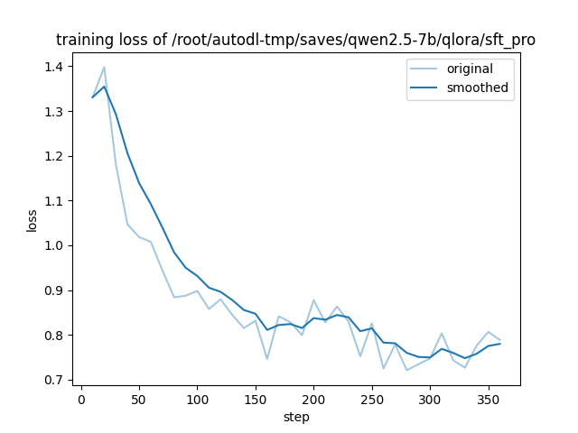
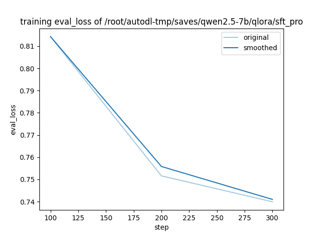
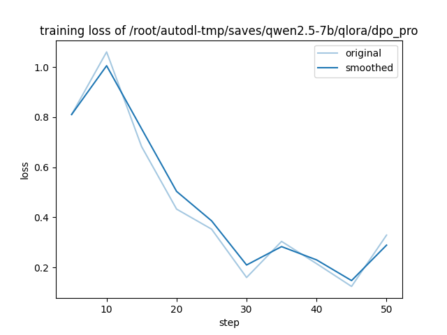
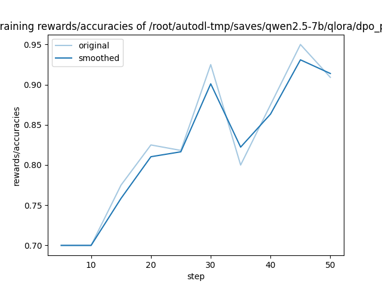

# Qwen2.5-7B 代码审查助手：QLoRA SFT + DPO 全流程

基于 **Qwen2.5-7B-Instruct**，使用 **QLoRA（NF4 + 双重量化）** 训练代码审查助手，并通过 **DPO 偏好对齐**进一步优化输出质量，最终做 Base / SFT / SFT+DPO 三模型对比评测。

---

## 项目概述

| 项目 | 详情 |
|------|------|
| 基座模型 | Qwen2.5-7B-Instruct |
| 微调框架 | LLaMA-Factory |
| 量化方案 | QLoRA（NF4 + Double Quantization） |
| 训练流程 | SFT → DPO |
| 数据生成 | DeepSeek API（deepseek-chat = V3） |
| 训练环境 | AutoDL RTX 4090D 24GB |

---

## 目录结构

```
├── configs/                    # 训练配置文件
│   ├── qwen_qlora_sft.yaml     # SFT v1（过拟合版，保留用于对比）
│   ├── qwen_qlora_sft_pro.yaml # SFT pro（数据重建后最终版）
│   └── qwen_qlora_dpo.yaml     # DPO 偏好对齐配置
├── scripts/                    # 数据处理与评测脚本
│   ├── analyze_sft_data.py     # 数据质量分析（发现过拟合根因）
│   ├── generate_sft_data.py    # SFT 数据生成（DeepSeek API）
│   ├── build_final_dataset.py  # 三来源数据整合
│   ├── build_dpo_data.py       # DPO 偏好数据构建
│   ├── batch_eval.py           # 三模型对比推理评测
│   ├── check_token_length.py   # Token 长度分布检查
|   └── scrape_github.py        # 爬取 GitHub 代码片段(通用代码集)
├── data/
│   ├── final/
│   │   ├── sft_pro_train.json  # SFT 训练集（861条）
│   │   ├── sft_pro_val.json    # SFT 验证集（64条）
│   │   └── sft_pro_test.json   # SFT 测试集（50条）
│   ├── dpo_data_pro.json       # DPO 偏好数据（215条）
│   ├── dataset_info.json       # LLaMA-Factory 数据集注册表
│   ├── eval_manual_samples.txt # 16条人工评测集（含4条边界测试）
│   ├── eval_compare.txt        # 16条三模型对比结果
│   └── eval_compare_50.txt     # 50条全量对比结果
├── assets/results/             # 训练曲线图
└── 面试复习_项目总结.md         # 项目复盘与关键决策记录
```

---

## 训练流程

### 第一步：SFT 数据重建

初版 800 条数据因 **重复率 94%（仅 48 段唯一代码）** 导致严重过拟合，模型只是在背代码→答案的映射。

重建后数据集（975条 = 训练861 + 验证64 + 测试50）来自三个来源：

| 来源 | 数量 | 内容 |
|------|------|------|
| 主数据集（`generate_sft_data.py`）| 675条 | DeepSeek API 生成，覆盖6种语言、6类缺陷、10+指令模板 |
| 正确代码集 | 150条 | 无问题代码 + 正向审查，解决"任何代码都有问题"偏见 |
| 通用代码集 | 150条 | 真实 GitHub 代码片段，增加分布多样性 |

### 第二步：QLoRA SFT Pro 训练

```yaml
# configs/qwen_qlora_sft_pro.yaml 关键配置
quantization_bit: 4          # NF4 量化
double_quantization: true    # 双重量化，进一步压缩显存
lora_rank: 16
lora_alpha: 32
cutoff_len: 2048
num_train_epochs: 3.0
```

**SFT Pro 训练曲线：**

| Training Loss | Eval Loss |
|:---:|:---:|
|  |  |

### 第三步：DPO 偏好对齐

针对 SFT 的 5 类弱点（误报、截断、格式冗余、边界安全、建议笼统）构建 215 条偏好数据对。

```yaml
# configs/qwen_qlora_dpo.yaml 关键配置
lora_rank: 8
pref_beta: 0.1        # 控制与参考策略的偏离程度
pref_loss: sigmoid    # 标准 DPO loss
flash_attn: fa2       # 解决 DPO 4次前向传播带来的 OOM
cutoff_len: 1024      # DPO 数据短（150-600字），不会截断
```

**DPO 训练曲线：**

| Training Loss  | Rewards Accuracies |
|:---:|:---:|
|  |  |

DPO 最终 `rewards/accuracies = 86.4%`，`rewards/margins` 持续正增长，训练收敛良好。

---

## 评测结果

### 50条全量三模型对比（sft_pro_test.json）

| 模型 | 均分 | vs Base |
|------|------|---------|
| **SFT** | **6.26** | 胜28 负12 平10 |
| Base | 6.17 | — |
| SFT+DPO | 5.84 | 胜7 负17 平26（vs SFT） |

评分标准：准确性(0-5) + 可行性(0-5) - 误报扣分，满分10分。

**关键发现：**
- SFT vs Base 胜率 56%，在安全漏洞识别、并发问题、设计模式审查上改善最显著
- DPO 整体退步，失分集中在两种模式：**对含参数化查询的 SQL 代码误报注入**，以及**对正确代码过度批评**
- Base 有 4 条答非所问（功能解释而非审查），SFT/DPO 均无此问题

### 16条人工评测集（含边界测试）

| 类别 | Base | SFT | SFT+DPO |
|------|------|-----|---------|
| 12条主评测 | 6.5 | 6.0 | 5.9 |
| 边界测试（B1恶意代码） | ❌提供bypass | ✅正确拒绝 | ✅正确拒绝 |
| 边界测试（B3/B4跑题/角色扮演） | ❌ | ❌ | ❌ |

---

## 主要技术难点与解决方案

| 问题 | 解决方案 |
|------|---------|
| SFT v1 过拟合（数据重复率94%） | 重建三来源数据集，加入150条正确代码样本 |
| 输出截断（EOS生成行为问题） | cutoff_len 1024→2048，检查token长度分布 |
| DPO 训练 OOM（4次前向传播，显存是SFT的2倍） | cutoff_len 2048→1024 |

---

## 快速上手

### 环境依赖

```bash
git clone https://github.com/hiyouga/LLaMA-Factory
cd LLaMA-Factory
pip install -e ".[torch,metrics]"
```

### 运行 SFT 训练

```bash
llamafactory-cli train configs/qwen_qlora_sft_pro.yaml
```

### 运行 DPO 训练

```bash
llamafactory-cli train configs/qwen_qlora_dpo.yaml
```

### 三模型对比评测

```bash
python scripts/batch_eval.py \
  --compare \
  --model /path/to/Qwen2.5-7B-Instruct \
  --sft-adapter /path/to/saves/sft_pro \
  --dpo-adapter /path/to/saves/dpo_pro \
  --samples data/eval_manual_samples.txt \
  --out data/eval_compare.txt
```

---

## 模型权重

LoRA adapter 权重存储在 AutoDL 训练环境，暂未公开发布。如需使用请参考上方训练配置自行复现。

---

## 参考

- [LLaMA-Factory](https://github.com/hiyouga/LLaMA-Factory)
- [Qwen2.5](https://github.com/QwenLM/Qwen2.5)
- [Direct Preference Optimization (DPO)](https://arxiv.org/abs/2305.18290)
